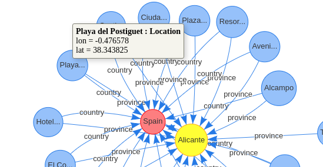

# Welcome to LETO's Tutorial

This tutorial will guide you through the usage of LETO in a specific example domain. The domain in question is about the province of Alicante, Spain, and mostly related to tourism information.

!!! warning
    Make sure to clear the database (button `💣 Clear database`) before following this tutorial, so that you start from scratch.

## Loading the first data set

The first data set we will analyze is related with some touristic locations in Alicante.
To begin, download the CSV file `locations_alicante.csv` [here](./data/locations_alicante.csv). If you open the file, you'll see something like the following:

```ts
location,lat,lon,country,province
Albir,38.570982499565076,-0.07026377183837483,Spain,Alicante
Alcampo,38.36708247502724,-0.4699022752090634,Spain,Alicante
Avenida Jovellanas,38.34789006276749,-0.4755058728788782,Spain,Alicante
Castillo de Alicante,38.349140160469716,-0.4780181728788511,Spain,Alicante
Castillo de Santa Bárbara,38.349140160469716,-0.4780181728788511,Spain,Alicante
Ciudad de la Luz,38.364444444444445,-0.43833333333333335,Spain,Alicante
El Corte Inglés,38.347524302739636,-0.48798528517226725,Spain,Alicante
...
```

This file contains structured information about some locations, including latitude and longitude. We'll feed LETO with this information to begin.

On the right side panel, under the `🔥 Load data` panel, select the loader named `From CSV files`.
Click the `Browse` button and select the file you just downloaded (`locations_alicante.csv`).
Then hit `🚀 Run`.

You should see a small green message at the bottom that says "Succesfully loaded...". This means the data was correctly loaded. Check the following image for reference:


## Exploring the data

Now that we have some data, let's run some queries. Start by typing `alicante` into the query textbox and see what happens. You should see something like the following image:


This graph represents a small context around the entity `Alicante`, which is the most similar entity to our input query `alicante`. You can see there are some locations that are related with `Alicante` and `Spain`. You can zoom, move, and otherwise interact with the graph to better explore it. If you hover over any of the nodes you'll see some relevant metadata:



Scrolling down you'll find additional visualizations about the subgraph that's being displayed. For example, you'll see a pie chart with the distribution of the locations that exist in the graph:


## Loading semi-structured data

Next, we want to enrich this information with another dataset, this time a CSV file that contains comments extracted from social media that mention some of the locations present in the graph. To do that, download the CSV file named `comments_alicante.csv` [here](./data/comments_alicante.csv). The file looks something like this:

```ts
comment:text,rating,date,likes,source,query:text,country
"Alicante sorprende por su buen clima...",5,2010-10-31,2,TripAdvisor,Alicante,Spain
"Estuvimos en Alicante. Hotel LA CITY...",5,2010-10-03,0,TripAdvisor,Alicante,Argentina
"El personal era realmente acogedor, ...",5,2010-12-04,3,TripAdvisor,Alicante,United Kingdom
```

The first column contains a natural language text with comments, and the rest are structured information. You'll notice that some columns are explicitely marked with a semantic tag (`:text`) to tell LETO how to treat these columns.

By default, LETO will try to infer if a column corresponds to an attribute, an entity, or a relation. To do so, it relies on some heuristics about the structure of the data. For example, columns that are unique short labels are taken as possible entity ids, while numbers and dates are taken as attributes. In this case, we are telling LETO to explicitly interpret `comment` and `query` as `text` rather than, say, an entity label.

We will this CSV as before using the `🔥 Load data` panel **but** we will explicitely define a name for the type of entity that will be created. In this case, we want each row in this CSV to be associated with an entity of type `Comment`, so we set the value of `main_entity` to `Comment`, just like the following image (also, make sure there's only one CSV selected and that `language` is set to `es`):


Go ahead and hit `🚀 Run`.

## Exploring the new data

Immediately after loading the new data you'll notice that the same query `alicante` now returns a slightly different graph (your colors may vary):


You'll see new `Comment` nodes that represent each of the lines in the CSV, along with their associated metadata (such as `rating` and `date`). Furthermore, each `Comment` node is related with some of the existing locations via a `mention` relation. This is because LETO performs some smart natural language processing to detect entities in text fields (such as `comment`) and automatically creates the corresponding relations to the associated semantic entities.

To make it more interesting, type `alicante mentions` in the query box. This has the effect of showing the same graph, but now the locations are displayed in a map:


This happens because the query now identifies the `mention` relationship explicitely, and thus the entities participating in that relationship are subject to visualization, and they happen to have location information associated with them.

To make it even more interesting let's try to compare the ratings of comments by location. Write the following query, `alicante ratings by location`, and you should see something like the following:


The magic happening here is that LETO will scan the graph looking for an attribute called `rating` in an object related with something of type `Location`. Similarly, you can try `alicante likes by location` and you'll see a similar graph. You can even combine both queries in `alicante ratings and likes by location` and you'll see both graphs:


## Adding time-indexed data

Next, we will add another CSV that contains time-indexed information. Download the file named `tourism_spain.csv` [here](./data/tourism_spain.csv) and load it into LETO. Se the `main_entity` label to `TourismInfo`. The data looks something like this:

```ts
country,date,tourists
Spain,2020-12,648989
Spain,2020-11,456814
Spain,2020-10,1020773
Spain,2020-09,1138868
```

Now type `spain` in the query box to see what happens. The graph will look something like the following, to reflect the facts that we know about `Spain`, including the previous entities and a new set of `TourismInfo` nodes that represent the data in the new CSV:


Now type `spain tourists by country` and you should see a timeseries graph like the following:


The magic here happens because there's a `date` attribute on the `TourismInfo` node, and it's associated via a `country` relation with the entities you mention. By understanding how LETO interprets a query, we can tinker with the input to achieve more or less what we want.
